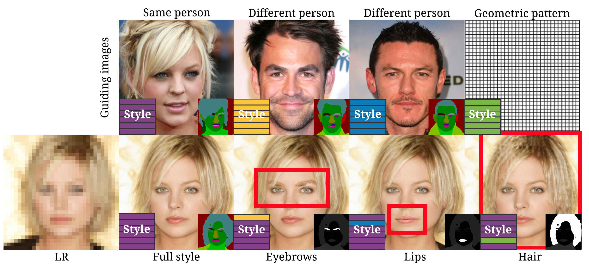
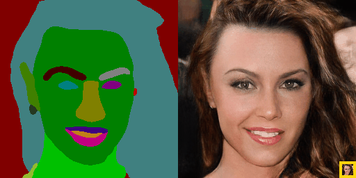
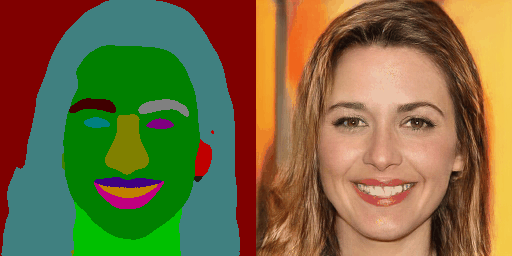

[](https://raw.githubusercontent.com/nvlabs/SPADE/master/LICENSE.md)


## DeepSEE: Deep Disentangled Semantic Explorative Extreme Super-Resolution
<p align="left"></p>
<p align="left"><div width="5px"></div></p><div width="5px"></div></p>


This is the official repository of this paper:

> **DeepSEE: Deep Disentangled Semantic Explorative Extreme Super-Resolution**<br>
> [Marcel Bühler](http://www.linkedin.com/in/mcbuehler/),  [Andrés Romero](https://ee.ethz.ch/the-department/people-a-z/person-detail.MjQ5ODc2.TGlzdC8zMjc5LC0xNjUwNTg5ODIw.html), and [Radu Timofte](https://people.ee.ethz.ch/~timofter/).<br>
> [Computer Vision Lab](https://vision.ee.ethz.ch/), [ETH Zurich](https://ethz.ch), Switzerland <br>
> **Abstract:** *Super-resolution (SR) is by definition ill-posed. There are infinitely many plausible high-resolution variants for a given low-resolution natural image. This is why example-based SR methods study upscaling factors up to 4x (or up to 8x for face hallucination). Most of the current literature aims at a single deterministic solution of either high reconstruction fidelity or photo-realistic perceptual quality. In this work, we propose a novel framework, DeepSEE, for Deep disentangled Semantic Explorative Extreme super-resolution. To the best of our knowledge, DeepSEE is the first method to leverage semantic maps for explorative super-resolution. In particular, it provides control of the semantic regions, their disentangled appearance and it allows a broad range of image manipulations. We validate DeepSEE for up to 32x magnification and exploration of the space of super-resolution.*

## Downloads
* Paper on [arxiv](https://arxiv.org/abs/2004.04433) ([PDF](https://arxiv.org/pdf/2004.04433)) (file size had to be reduced to arxiv constraints)
* Main paper in full resolution ([9 MB](https://deepseeresources.s3.us-east-2.amazonaws.com/DeepSEE_main_full-resolution.pdf))
* Supplementary material in full resolution ([14 MB](https://deepseeresources.s3.us-east-2.amazonaws.com/DeepSEE_supp_full-resolution.pdf))

## [License](https://raw.githubusercontent.com/nvlabs/SPADE/master/LICENSE.md)

Copyright (C) 2019 NVIDIA Corporation.

All rights reserved.
Licensed under the [CC BY-NC-SA 4.0](https://creativecommons.org/licenses/by-nc-sa/4.0/legalcode) (**Attribution-NonCommercial-ShareAlike 4.0 International**)

## Installation
We will release code and pre-trained models soon. Make sure to star our repository to stay tuned.

## Citation
```
@misc{bhler2020deepsee,
    title={DeepSEE: Deep Disentangled Semantic Explorative Extreme Super-Resolution},
    author={Marcel Christoph Bühler and Andrés Romero and Radu Timofte},
    year={2020},
    eprint={2004.04433},
    archivePrefix={arXiv},
    primaryClass={cs.CV}
}
```
